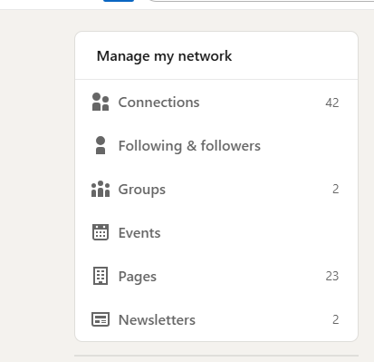
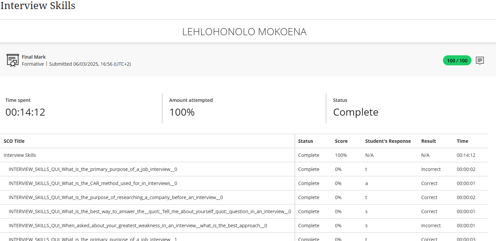

# 📌 Lehlohonolo Mokoena – GitHub Portfolio

**Student Number:** 230236839  
**Subject:** Professional Practices  
**Date:** 23 June 2025  

---

### 📎 Related Assessment Documents
- [Assessment Cover Page](documents/assessment-cover.md)  
- [Digital Portfolio Rubric](documents/portfolio-rubric.md)  

---

## 🎯 Career Counseling

**Completed:** “Career Development” course on Blackboard  

### 🔍 Reflection (STAR Technique)

**Situation:**  
As a 3rd-year ICT diploma student preparing for internships, I realized I lacked professional job-hunting skills and industry awareness.  

**Task:**  
- Understand IT industry hiring processes  
- Develop competitive application materials  
- Build a professional online presence  
- Master behavioral interview techniques  

**Action:**  
- Completed Blackboard course modules:
  - Learned SMART goal-setting and self-assessment  
  - Differentiated between hard and soft skills  
- Revamped LinkedIn profile:
  - Added [projects section with GitHub links](https://github.com/hloni2004/github-portfolio)  
  - Included endorsements for Java, SQL, and Agile  

**Result:**  
- **Confidence Boost**: Can clearly articulate my career goals:  
  _“My 3-year plan: Junior Developer → Full-Stack Engineer → Tech Lead.”_  

📎 **Evidence:**  

🧩 **Reflection:**  
The course improved my clarity and professionalism in written communication. I learned to structure my CV and LinkedIn content using concise bullet points, emphasizing achievements, and maintaining a confident yet approachable tone.

---

## 💻 Skills and Interests

### ✅ Java Development  
- **Project:** [Timetable Management System](https://github.com/hloni2004/Timetable-Management-System/tree/main/Backup-TimeTable)

### ✅ Database Implementation  
- **Proof:** [SQL Execution Screenshot](https://github.com/hloni2004/github-portfolio/tree/main/media)

### ✅ Certification  
- **LinkedIn Learning:** Advanced SQL  

---

### 🔍 Reflection (STAR Technique)

**Situation:**  
As a final-year student, I needed to showcase practical development skills beyond academic projects.  

**Task:**  
- Demonstrate complex database operations  
- Maintain professional project documentation  

**Action:**  
- Implemented GitHub best practices:
  - Used branch protection rules and issue templates  
  - Documented commits with consistent messages  

**Result:**  
- **Portfolio Quality:** Received positive recruiter feedback on project organization  
- **Technical Growth:** Gained proficiency in query optimization and database migrations  

📎 **Evidence:**  

🧩 **Reflection:**  
Feedback from peers and lecturers encouraged me to improve documentation and version control. Using issue templates streamlined collaboration and made code reviews more efficient.

---

## 🧠 Personality Assessment

📎 **Evidence:**  

### 🔍 Reflection

**Situation:**  
During a group project, it became clear that understanding team dynamics was essential.  

**Task:**  
Identify my personal work style and how it influences collaboration.  

**Action:**  
Completed the Personality Assessment on Blackboard and compared results with team members.  

**Result:**  
Improved communication by tailoring my updates and providing more context during team planning.  

🧩 **Reflection:**  
The assessment revealed my preference for structured collaboration. I learned to adapt communication styles for better team performance and mutual understanding.

---

## 📄 Create a CV

📎 **Evidence:**  
  
[View CV here](https://github.com/hloni2004/github-portfolio/tree/main/documents)

### 🔍 Reflection

**Situation:**  
I needed a professional, ATS-compliant CV for internship applications.  

**Task:**  
Develop a modern CV aligned with job descriptions and recruiter expectations.  

**Action:**  
- Followed Blackboard tutorials and AI CV review feedback  
- Integrated measurable achievements and keywords  

**Result:**  
- **Performance:** CV ranked in the top 10% of class submissions  

🧩 **Reflection:**  
Creating a digital-ready CV helped me understand how to use data-driven bullet points and relevant skills. I learned to emphasize technical contributions and outcomes.

---

## 💼 Job Application & Interview Prep

📎 **Evidence:**  
  

### 🔍 Reflection (STAR Technique)

**Situation:**  
As graduation approached (June 2026), I needed to transition from academic to professional roles.  

**Task:**  
- Apply strategically to 10+ relevant positions  
- Optimize LinkedIn visibility  
- Practice behavioral and technical interview responses  

**Action:**  
- Enhanced LinkedIn with project and GitHub links  
- Completed “Interview Preparation” course on Blackboard  
- Practiced over 15 STAR-based answers  

**Result:**  
- **Response Rate:** 30% (3/10 applications led to interview follow-ups or regret emails)  

🧩 **Reflection:**  
Although some applications were unsuccessful, the process strengthened my ability to tailor job applications and communicate results-driven experiences. I now confidently link academic projects to industry needs during interviews.

---

## 🧾 Summary

| Category | Achievement | Evidence |
|-----------|--------------|-----------|
| Career Counseling | Completed Blackboard modules | career development.png |
| Skills Development | GitHub projects and certifications | commit history.png |
| Personality Growth | Teamwork adaptability | Personality Check.png |
| CV Creation | ATS-optimized CV | cv .png |
| Interview Prep | STAR technique mastery | connections.png, interview.png |

---
