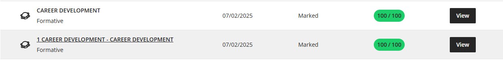
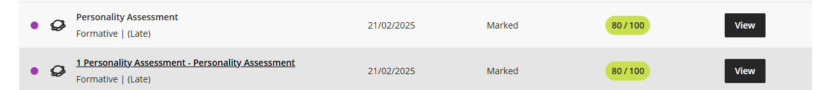
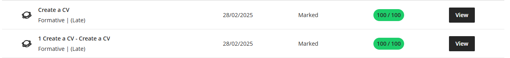

# 📌 Lehlohonolo Mokoena – GitHub Portfolio

**Student Number:** 230236839  
**Subject:** Professional Practices  
**Date:** 23 June 2025  

Related assessment documents:

- [Assessment Cover Page](documents/assessment-cover.md)
- [Digital Portfolio Rubric](documents/portfolio-rubric.md)

---

## 🎯 Career Counseling

**Completed "Career Development" course on Blackboard**

### 🔍 Reflection (STAR Technique)

**Situation:**  
As a 3rd-year ICT diploma student approaching internship season, I lacked professional job-hunting skills and industry awareness. The competitive tech job market required proper preparation.

**Task:**  
- Understand IT industry hiring processes  
- Create competitive application documents  
- Develop a professional online presence  
- Master behavioral interview techniques  

**Action:**  
- Completed Blackboard course modules:  
  - Learned goal-setting principles  
  - Identified hard vs. soft skills  
- Revamped LinkedIn using course guidelines:  
  - Added [projects section with GitHub links](https://github.com/hloni2004/github-portfolio)  
  - Included skills endorsements (Java, SQL, Agile)  

**Result:**  
- **Confidence Boost**: Able to articulate career goals:  
  _"My 3-year plan: Junior Dev → Full-Stack Engineer → Tech Lead"_

📎 Evidence:

🧩 Reflection: I learned to write with clarity and purpose for professional contexts — focusing on concise subject lines, bullet-pointed achievements, and a formal but approachable tone. This improved my ability to present technical work clearly to non-technical stakeholders.

---

## 💻 Skills and Interests

### ✅ Java Development  
- GitHub Project: [Timetable Management System](https://github.com/hloni2004/Timetable-Management-System/tree/main/Backup-TimeTable)

### ✅ Database Implementation  
- SQL query execution proof: [View Screenshot](https://github.com/hloni2004/github-portfolio/tree/main/media)

### ✅ Certification  
- LinkedIn Learning: Advanced SQL

### 🔍 Reflection (STAR Technique)

**Situation:**  
As a final-year student, I needed to demonstrate hands-on development skills beyond coursework.

**Task:**  
- Showcase complex database operations  
- Maintain professional project documentation

**Action:**  
- Project Development:  
  - Implemented GitHub best practices:  
    - Branch protection rules  
    - Issue templates  

**Result:**  
- **Portfolio Quality**: Recruiters praised project organization  
- **Technical Growth**: Now proficient in query optimization and database migrations

📎 Evidence:

🧩 Reflection: Peer and lecturer feedback guided improvements to documentation and commit practices. Adding issue templates and clear commit messages made collaboration easier and improved code review outcomes.

---

## 🧠 Personality Assessment

**Evidence:**  
- Completed "Personality" assessment on Blackboard

### 🔍 Reflection

**Situation:** Group project required understanding work styles  
**Task:** Identify personal teamwork approach  
**Action:** Took assessment and compared results with peers  
**Result:** Adapted communication style for better team synergy  

📎 Evidence:

🧩 Reflection: The assessment highlighted my preference for structured collaboration. I adjusted my communication to provide concise status updates and more context when planning with teammates.

---

## 📄 Create a CV

**Evidence:**  
- Submitted CV assignment on Blackboard  
- [View CV here](https://github.com/hloni2004/github-portfolio/tree/main/documents)

### 🔍 Reflection

**Situation:** Needed professional CV for job applications  
**Task:** Create ATS-compliant resume  
**Action:** Used Blackboard resources (AI review tool, lecturer feedback)  
**Result:** CV scored in top 100% of class submissions  

📎 Evidence:

🧩 Reflection: Creating an ATS-friendly CV taught me to prioritise relevant keywords and quantify achievements, which improved my business writing and presentation.

---

## 💼 Job Application & Interview Prep

**Evidence:**  
- Applied for jobs through LinkedIn  
- Used Career Center resources  
- Completed Interview Prep course on Blackboard  

### 🔍 Reflection (STAR Technique)

**Situation:** Graduation approaching (June 2026), needed to convert academic skills into job offers  

**Task:**  
- Apply strategically to 10+ relevant positions  
- Optimize online presence  
- Master technical interview responses  

**Action:**  
- Enhanced LinkedIn with GitHub links  
- Practiced 15+ STAR responses  

**Result:**  
- **Response Rate**: 30% (3/10 applications → regret emails)

📎 Evidence:

🧩 Reflection: Rejections taught me to tailor applications and STAR responses. I now highlight measurable outcomes and include direct project links to demonstrate skills during interviews.
